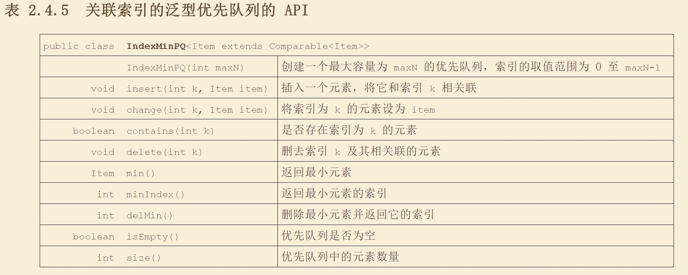

# 优先队列

## API
+ 创建优先队列
+ 创建初始两位Max的优先对立e
+ 用A[]中的元素创建一个优先队列
+ 插入元素
+ 返回最大元素
+ 删除并返回最大元素
+ 返回队列是否为空
+ 返回优先队列中的元素个数
  
---
## 堆的定义  
+ 当一棵二叉树的每个节点都大于等于它的两个子节点时，成为堆有序。  

+ **命题O:** 根节点是堆有序的二叉树中的最大节点。

+ 二叉堆是一组能够堆有序的完全二叉树排序的元素，并在数组中按照层级存储（不是用数组中的第一个位置）
    + 父节点的位置为K/2 而他的两字节点的位置分别问2K和2K+1

+ **命题 P：**   一颗大小为N的完全二叉树的高度为ln（N）

## 堆的算法
+ 上浮 
  + 在数组处于非有序状态时，将子元素中大的节点与父节点交换，知道不再需要交换为止
+ 在插入元素时将新的节点插入到最后的，并执行上浮
+ 下沉
  + 在数组处于非有序状态时，将父元素中较小的节点与子元素最大的节点进行交换。

+ 在删除最大节点元素后，将最后一个节点的值放到最前，然后使用下沉，使之能够变得有序。

+ 多叉堆

+ **命题Q** 对于一个含有N个元素的基于堆的优先队列，**插入元素**操作只需要不超过lg（N+1）次比较。**删除最大元素**的操作不需要超过2lg（N）次比较。
+ 索引优先队列
  + 将元素与索引进行绑定了的堆。
  + **命题Q（续）** 在大小为N的索引优先队列中，插入，改变优先级，删除，删除最小元素操作所需的比较次数和log（N）成正比。
  + API
    
  + 用例
    + 解决多项归并问题，将多个有序输入流规程一个有序的输出流

## 堆排序
+ 堆的构造
  + 开始只扫描一半元素。
  + **命题R：** 下沉操作由N个元素构造堆只需要少于2N次比较以及N次交换 
+ 下沉排序
  + **命题S：**将N个元素排序，堆排序只需要少于2Nlg（N）+2N次比较。
+ 堆排序在实际中应用较少，理由是实际运行的效果一般。