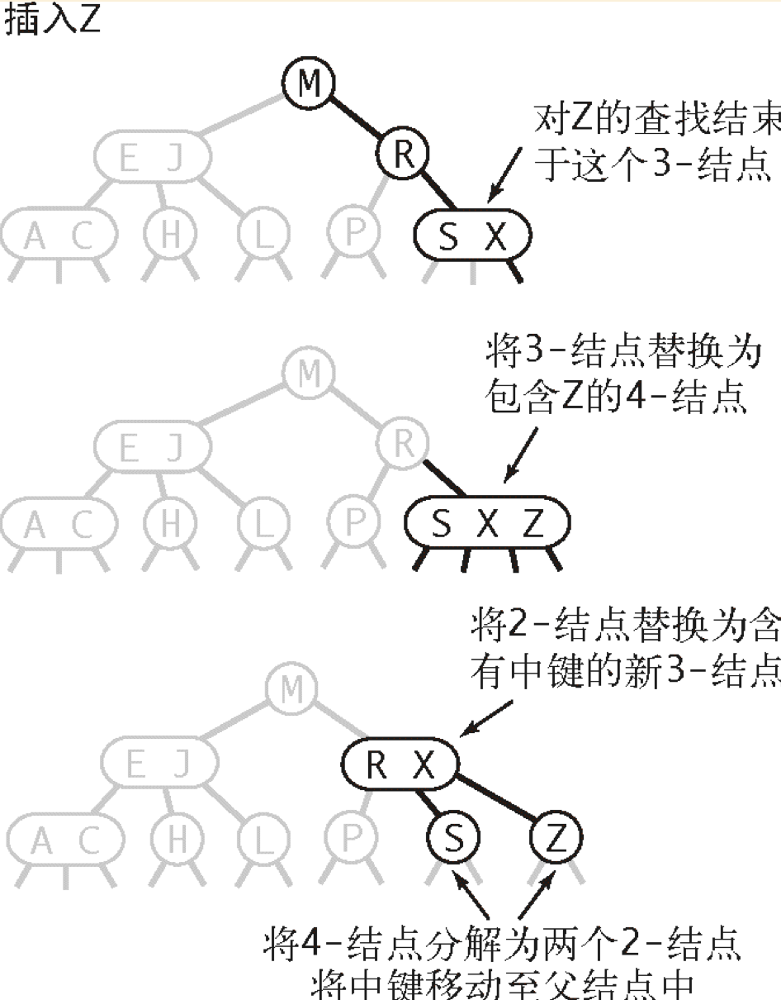

# 红黑树（平衡二叉树）
## 2-3 查找树
+ 2-结点 3-结点
  + 2-结点，含有一个键和两条链接，左链接指向2-3树中的键都小于该结点，右链接指向的2-3树中的键都大于该结点。
  + 3-结点，含有两个键和三条链接，左链接指向的2-3树中的键都小于该结点，中链接指向的2-3树中的键都位于该结点的两个键之间，右链接指向的2-3树中的键都大于该结点。
  + 图示 
    + 
+ 查找 
  + 与二叉查找树中的递归查找方法类似。
+ 插入
  + 向2-结点中插入新键，使之变成3-结点。
  + 向3-结点插入新键
    + 3-结点为根结点时，新键插入到3-结点后使之临时成为4-结点。然后将其中的中值键成为根，其他两个键成为根的左子结点和右子结点。
    + 向父结点为2-结点的3-结点插入新键时，新键插入到3-结点后使之临时成为4-结点。然后将中值键提升到父结点，将其他两个键成为左子结点和右子结点。
      + 图示
      + 
    + 向父结点为3-结点的3-结点插入新键时，新键插入到3-结点后使之临时成为4-结点。然后将中值键提升到父结点，父结点临时成为4结点后，根据上述两种情况继续进行调整。
      + 图示
      + 
  + 局部变换
    + 2-3树插入算法的根本在于这些变化都是局部的，除了相关的结点和链接之外不必修改或者检查书的其他部分
    + 
  + 全局性质
    + 局部变换不会影响树的全局有序性和平衡性，任意空链接到根结点的路径长度都相等。
+ **命题F：** 在一棵大小为N的2-3树中，查找和插入操作访问的结点必然不超过lg（N）个。

## 红黑二叉查找树
+ 结点
  + 红链接 将两个结点连接起来构成一个3-结点。
  + 黑连接 2-3树中的普通链接。
  + 将3-结点表示为一条左斜的红色链接项链的两个2-结点。
+ 红黑树的另一种定义
  + 红链接均为左链接。
  + 没有任何一个结点同时和两条红链接相连
  + 该树是完美黑色平衡的，即任意空链接到根结点的路径上的黑链接数量相同。
+ 颜色表示
  + 约定空链接为黑色
  + 根结点为黑色
+ 旋转
  + 左旋转
    + 图示
    + 
  + 右旋转
    + 图示
    + 
  + 旋转操纵保证树的有序性和平衡性。
+ 插入
  + 向单个2-结点插入新建。
    + 新键小于老键，插入到左子结点，产生了一个左红链接。
    + 新键大于老键，插入到右子结点，产生了一个不合理的右红链接，此时需要左旋转进行调整。
  + 向树底部2-结点插入新键
    + 如果指向新结点的是父结点的左链接，那么父结点直接成为了3-结点
    + 如果指向新结点的是父结点的右链接，那么产生了右红链接，此时需要左旋进行调整。
    + 图示
    + 
  + 向一棵双键树中插入新键
    + 新键大于原树中的两个键，添加到两个键的右子结点。此时是树是平衡的且左右两个红色链接，进行颜色转换处理（后续说明）。
    + 新键小于原树中的两个键，添加到最左边的空链接，产生了两个连续的红链接。只需将上层红链接右旋转即可得到第一种情况。
    + 新键介于两个键中间，添加到老的小的键的右子链接中，产生了两个连续的红链接，先左旋转，后右旋转。
    + 图示
    + 
  + 颜色转换
    + 将左右子节点的颜色由红变黑，同时将父结点的颜色转换成红色。
  + 向树底部的3-结点插入新键
    + 图示
    + 
  + 插入操作中红链接的向上传递
    + 如果右子节点为红色，左子节点为黑色，则左旋转
    + 如果左子节点为红色，它的左子节点也为红色，则右旋转
    + 如果左节点和有结点都为红色，则进行颜色转换。
+ 删除
  + 2-3-4 树  允许树中存在4-结点的树
  + 删除最小键
    + 为了保证不会删除一个2-结点，沿着左链接向下进行变换，确保当前结点不是2-结点。  
    + 首先根结点可能右两种情况，如果根是2-结点，且它的两个子节点都是2-结点，我们可以直接将这三个结点变成一个4-结点，否则我们需要保证根结点不是2-结点，如有必要可以从它的右侧兄弟结点"借"一个键。
    + 图示
    + 
## 红黑树的性质
+ 所有基于红黑树的符号表实现都能保证操作的运行时间为对数级别。
+ **命题G：** 一颗大小为N的红黑树的高度不会超过2lg（N）
+ **命题H：** 一棵大小为N的红黑树中根结点到任意结点的平均路径长度为～1.00lg(N)
+ **命题I:** 在一棵红黑树中，以下操作在最坏情况下所需的时间是对数级别的：查找（get()）、插入（put()）、查找最小键、查找最大键、floor()、ceiling()、rank()、select()、删除最小键（deleteMin()）、删除最大键（deleteMax()）、删除（delete()）和范围查询（range()）。
