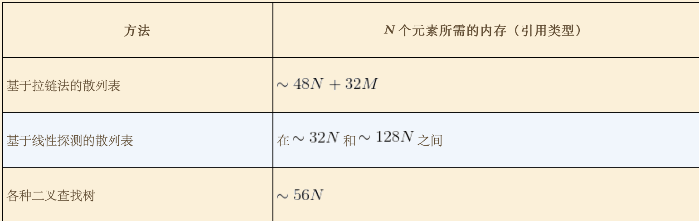

# 散列表
+ 散列表的核心问题
  
  + 散列方法
    + 将键转换为索引的方法。将整数散列的最常用方法是除留余数法。模的大小一般取素数。
    + 如果键对象含有多个成员，则对每个成员变量计算散列值。
      + 书中给出日期类型计算散列值的例子 `int hash=(((day*R+month)%M)*R+year)%M;`
    + Java的约定
      + equals方法和hashCode方法，重写时必须同时修改。理由是当两个对象相等时其散列值也必须相等。反之不一定相等。
    + hashCode方法的返回值为32为整数，需要将其转换为0～M-1区间的值。首先将其转换为31位非负整数后对M取模
      + `private int hash(Key x){ return  (x.hasCode & 0x7fffffff) % M}`
    + **假设J(均匀散列假设)**  我们使用的散列函数能够均匀并独立的将所有的键散布于0到M-1之间。
  + 处理碰撞冲突
    + 基于拉链法
      + 将大小为M的数组中的每个元素指向一条链表，链表中的每个结点都存储了散列值为该元素的索引键值对。
      + 在链表上的操作的实现是，利用无序符号表的API
      + 查找时首先找到对应的链表，然后沿着链表顺序查找相应的键。
      + **命题K：** 一张含有M条链表和N个键的散列表中，（在假设J成立的前提下）任意条链表中键的数量均在N/M的常数因子范围内的概率无限趋近于1。
      + **性质L：** 一张含有M条链表和N个键的散列表中，未命中查找和插入操作所需的比较次数为～N/M。
    + 基于探测法
      + **线性探测发：** 当一个键的散列值已经被另一个不同的键占用），我们直接检查散列表中的下一个位置（将索引值加1）
      + 删除操作
        + 删除键对应位置的值之后，将其位置右侧的键删除后重新插入到散列表中。
      + 基于探测法的实现，需要动态调整数组的大小。否则会陷入无限循环。
        + 动态调整的大小会保证使用率在1/8～1/2之间。
      + 健簇
        + 在数组中连续存在的键。
      + **命题M：** 在一张大小为M并含有N=（alpha）* M个键的基于线性探测的散列表中，基于假设J，命中与为命中的查找所需的探测次数分别为～1/2 *（1-（1/1-alpha））， ～1/2 *（1-（1/（1-alpha）^2））
  + 调整数组大小
    + 探测法必须使用数组大小的调整，拉链法不一定需要调整数组大小只要M适当即可。
    + **命题N：** 假设一张散列表能够自己调整数组的大小，初始为空。基于假设J，执行任意顺序的**t**次查找，插入，删除操作所需的时间和t成正比，所使用的内存量总是在表中的键的总数的常数因子范围内。
  + 内存使用
    + 图示
    + 
  + 散列表的API与符号表基本一致。详细可参考3.1节的总结。