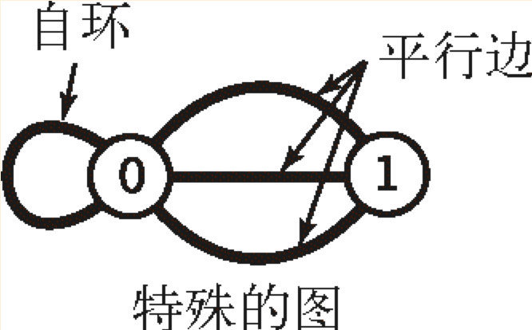
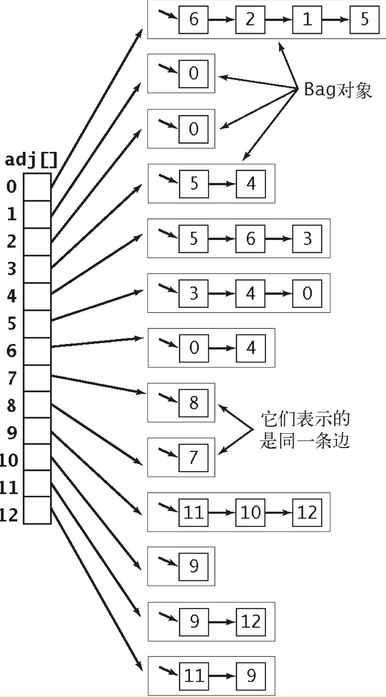
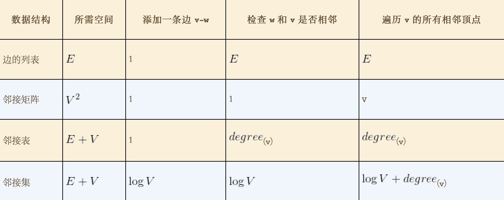
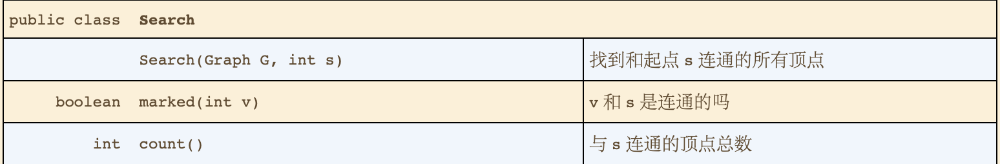
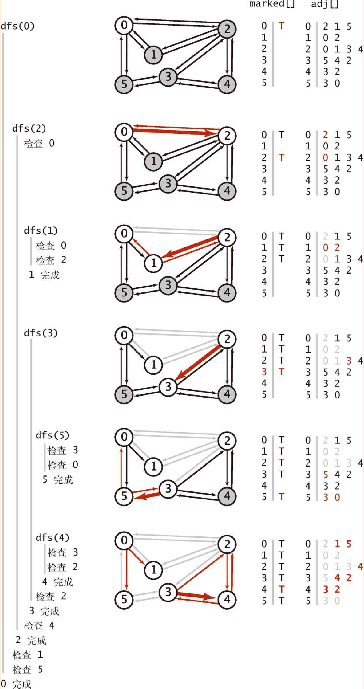
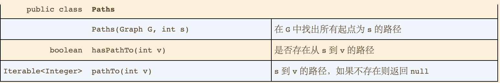
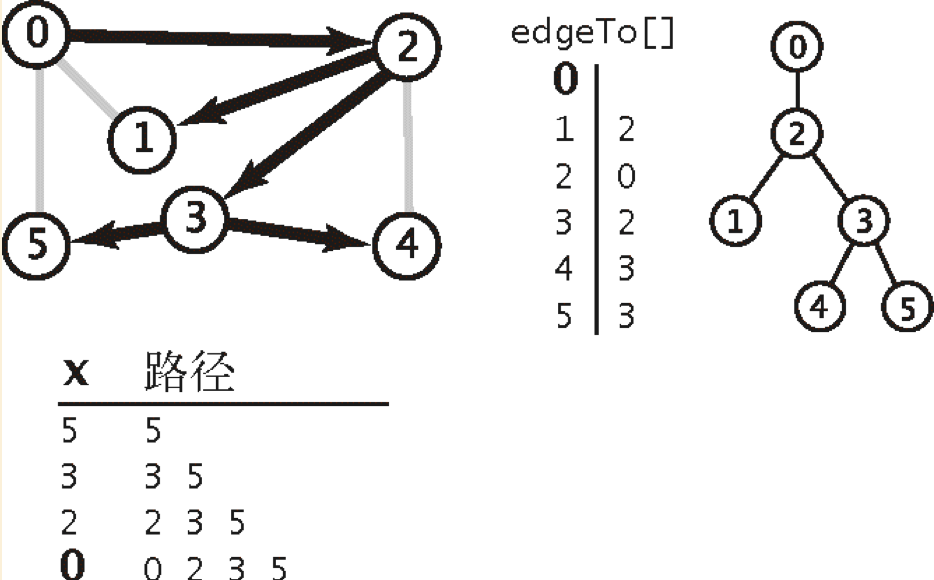
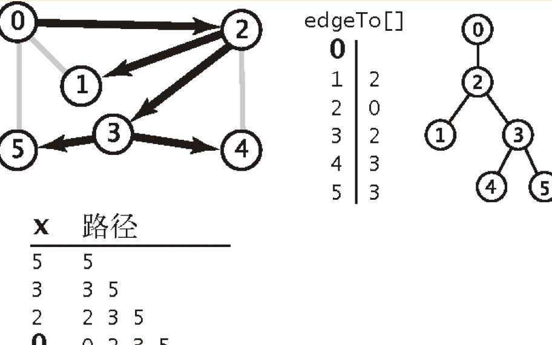
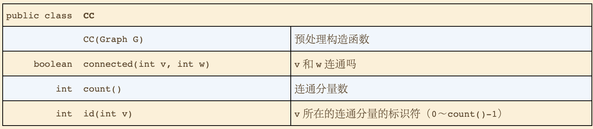
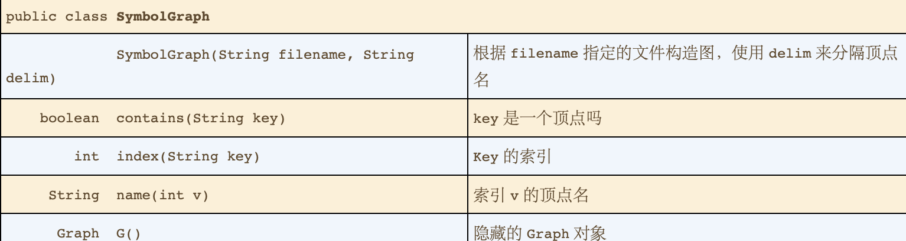

# 4.1 无向图

* 定义
  * 图是由一组顶点和一组能够将两个顶点相连的边组成的。
  * 特殊的图
    * **自环：** 一条连接一个顶点和自身的边。
    * **平行边：** 连接同一对顶点的两条边。
    * 
* 术语表
  * **相邻：** 两个顶点通过一条边相连时，两个顶点是相连的。并称这条边 **依附于** 这两个顶点。
  * **度数：** **依附于** 顶点的边的总数。
  * **子图：** 一幅图的所有边的的一个子集组成的图。
  * **路径：** 是由边顺序连接的一系列顶点。
  * **简单路径：** 是一条没有没有重复顶点的路径。
  * **环：** 是一条至少含有一条边且起点和终点相同的路径。
  * **简单环：** 是一条（除了起点的终点必须相同之外）不含有重复顶点和边的环。
  * **连通：** 两个顶点之间存在一条连接双方的路径时，我们称一个顶点和另一个顶点时连通的。
  * **连通图：** 如果从任意一个顶点都存在一条路径到达另一个任意顶点，我们称这幅图是连通图。一幅 **非连通图** 由若干连通的部分组成。
  * **树：** 是一幅无环连通图。
  * **森林：** 互不相连的树组成的集合为森林。
    * 当且仅当一幅含有Vge结点的图G满足下列5个条件之一时，他就是树。
      * G有V-1条边且不含有环。
      * G有V-1条边且时连通的。
      * G是连通的，但删除任意一条边都会使它不再连通。
      * G是无环图，但添加任意一条边都会产生一条环。
      * G中任意一对顶点之间仅存在一条简单路径。
  * **图的密度：** 已经连接的顶点对占所有可能被连接的顶点对的比例。
    * 稀疏图
    * 稠密图
  * **二分图：** 一种能够将所有结点氛围两部分的图，其中图的每条边所连接的两个顶点都分别属于不同的部分。
    * 
* 无向图的数据类型
  * API
    * 
  * 图的表示方法
    * 邻接矩阵
    * 边的数组
    * 邻接表数组
      * 使用一个以顶点为索引的列表数组，其中每个元素都和该顶点相邻的顶点列表。
      * 
      * 每个顶点的所有相邻顶点都保存在该顶点对应的元素所指向的一张链表中。
      * 添加一条V与W的边，将W添加到V的邻接表中并把V添加到W的邻接表中。
      * 实现的性能特点
        * 使用的空间和V+E称正比
        * 添加一条边所需时间为常数。
        * 遍历顶点V的所有相邻顶点所需的时间和v的度数成正比。
    * 邻接集
      * 将SET代替Bag来实现。
    * 性能复杂度
      * 
  * 图处理算法的设计模式
    * 将图的表示与实现分离开的方式，当然也可以放在Graph类里。
    * Search
      * API
        * 
* 深度优先搜索
  * 优先探索邻接的结点，并将以访问的结点标记为以访问。
    * 实现逻辑
      * 访问其中一个结点时，将它标记为已访问。
      * 递归的访问所有没有被标记过的结点。
  * **命题A：** 深度优先搜索标记与起点连通的所有顶点所需的时间和顶点的度数之和成正比。
  * 深度优先的详细轨迹
    * 
  * 能够解决的问题
    * 连通性，给定一幅图，回答"两个给定顶点是否连通"或者有多少个连通子图"。也叫路径检测问题。
    * 单点路径，给定一幅图和一个起点s，回答"从s到给定目的顶点v是否存在一条路径？如果有找出这条路径"。
* 寻找路径
  * API
    * 
  * 实现
    * 添加实例变量edgeTo[]数组，该数组在深度优先探索过程中，会以没有被标记的临近为索引，记录当前结点为值。
    * 计算轨迹
      * 
    * **命题A（续）** 使用深度优先搜索得到从给定起点到任意标记顶点的路径的长度成正比。
* 广度优先搜索
  * 解决问题
    * **单点最短路径：** 给定一幅图和一个起点s，回答"从s到给定目的顶点v是否存在一条路径？"如果有找出其中最短路径。
  * API
    * API与探索那一节的API一致。提供是否连通与顶点总数。
    * 使用广度优先的寻找路径方法可获得，起始点到所有连接的顶点的距离。
  * 实现逻辑
    * 现将起点加入到队列，然后重复以下步骤直至队列为空。
      * 取队列中的下一个顶点v并标记它。
      * 将与v相邻的所有违背标记的顶点加入到队列。
    * 
  * **命题B：** 对于从s可达的任意顶点v，广度优先搜索都能找到一条从s到v的最短路径（没有其他从s到v的路径所含的边比这条路径更少）。
  * **命题B（续）：** 广度优先搜索所需的时间在最坏情况下和V+E成正比。

* 连通分量
  * 连通分量 
    * 可以理解为某一顶点是否与另一个顶点是等价类，即在一个图中。
  * API
    * 
  * 实现
    * 循环图的所有结点，在循环内实行深度优先的变体，得到连通分量的处理。
    * 在使用深度优先的递归的过程中，使用id数组标记与起始顶点连通了的结点，将该结点使用作为索引，并将该索引的值设为与起始顶点相同的连通值？
  * **命题C：** 深度优先搜索的预处理使用的时间和空间与C¥V+E成正比且可以在常数时间内处理关于连通性查询。
    
* 深度优先搜索的其他实例
  * 双色问题，能够用两种颜色将图的所有顶点着色，使得任意一条的两个端点颜色都不同。二分图。
  * 无环图的判断。
  * 二分图的判断

* 符号图
  * 使用字符串而不是用整数来表示顶点
  * API
    * 
  * 符号图的实现
    * 一个符号表st，键的类型为String（顶点名），只为整数（索引）。
    * 一个数组keys[],用作反响索引，保存每个顶点索引对应的顶点名。
    * 一个Graph，它使用索引来饮用图中顶点。
  