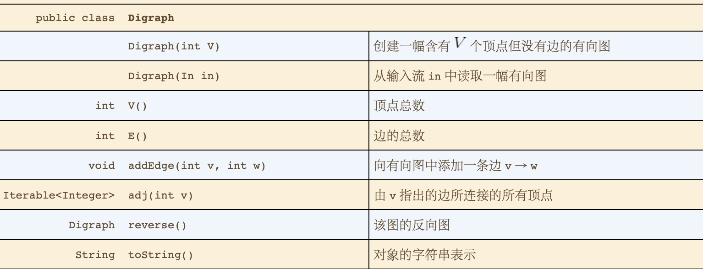

# 有向图
* 应用
  * 
* 术语
  * **定义：** 一幅有方向性的图是由一组顶点和一组有方向的边组成的，每条有方向的边都连接着有序的一对顶点。
  * 有一条有向边由第一个**指出** 并**指向** 第二个顶点。
  * 在一个有向图中，一个顶点的**出度**由该顶点指出的边的总数，一个顶点的**入度**为指向该顶点的边的总数。
  * **有向路径：** 由一系列顶点组成，对于其中的每个顶点都存在一条有向边从它指向序列中的下一个顶点。
  * **有向环：** 为一条至少含有一条边且起点和终点相同的有向路径。
  * **简单有向环：** 是一条（除了起点和终点必须相同之外）不含邮重复的顶点和边的环。
* API
  * 
  * 有向图的使用邻接表来表示
  * 有向图反向，所有边的方向反转
* 有向图的可达性
  * 给定一幅有向图和一个起点是，回答是否存在一条从s到达给定顶点v的有向路径？
  * 使用深度优先搜索实现。
  * API
    * 
  * 多点可达性
    * 给定衣服有向图和顶点的集合，回答"是否存在一条集合中的任意顶点到达给定顶点v的有向路径？
  * **命题D** 在有向图中，深度优先搜索标记由一个集合的顶点可达的所有顶点所需的时间与被标记的所有顶点的出度和之和成正比。
  
  * 有向图的寻路
    * DepthFirstPaths与BreadthFirstPaths也是有向图处理的重要算法。实现中仅将Graph换成Digraph即可。
    * 单点有向路径
    * 单点最短路径
* 环和有向无环图
  * 调度问题
    * 优先级限制，表明那些任务必须在哪些任务之前完成。
  * 拓扑排序
    * **定义：** 给定一幅有向图，将所有的顶点排序，使得所有有向边均从排在前面的元素指向排在后面的元素。
    * 拓扑排序的典型应用
      * 
    * API
      * 
    * 有向无环图
      * DAG一幅不含有环的有向图。
      * 环的检测
        * 利用深度优先搜索，可检测环。
        * API
          * 
    * 命题E
      * 当且仅当一幅有向图是无环图时它才能进行拓扑排序。
    * 深度优先排序的排列顺序
      * 前序
        * 递归调用之前将顶点加入队列。
      * 后续
        * 递归调用之后将顶点加入队列
      * 逆后续
        * 递归调用之后将顶点压入栈
    * 拓扑排序的实现
      * **命题F：** 一幅有向无环图的拓扑顺序极为所有顶点的逆后续排列。
      * **命题G：** 使用深度优先搜索对有向无环图急性拓扑排序所需时间和V+E成正比
* 有向图中的强连通性
  * **定义：** 如果两个顶点v和w是相互可达的，则称他们为强连通的，也就是说，既存在一条从v到w的有向路径，也存在一条w到v的有向路径。如果一幅有向图中的任意两个顶点都是强连通的，则称这幅有向图也是强连通的。
  * 两个顶点强连通的当且仅当他们都在一个普通的有向环中
  * 强连通分量
    * 与无向图的连通性一样，有向图中的强连通性也是一种顶点之间的等价关系。
    * **定义：** 强连通性将所有顶点分为了一些等价类，每个等价类都是由相互均为强连通的顶点的最大子集组成，将这些子集称为强连通分量。
    * 典型应用
      * 
    * API
      *  
    * Kosaraju算法
      * 计算连通分量的算法，实现方式如下。
        * 在给定的一幅有向图G中，使用DepthFirstOrder来计算它的反向G——R的逆后续排列。
        * 在G中进行标准的深度优先搜索，但是按照刚才计算得到顺序而非标准的顺序来访问所有为标记的顶点。
        * 在构造函数中，所有在同一个递归dfs调用中被访问的顶点都在一个强连通分量中，将他们按照ConnectComponent相同的方式识别出来。
      * **命题H：** 使用深度优先搜索查找给定有向图G的反向图G-R，根据由此得到的所有顶点的逆后续再次使用深度优先搜索处理有向图G，其构造函数中的每一次递归调用所标记的顶点都在同一个强连通分量中。
      * **强连通性：** 回答"给定的两个顶点是强连通的吗？这幅有向图中含有多少个强连通分量？"
      * **命题I：** Kosaraju算法的预处理所需的时间和空间与V+E成正比且支持常数时间的有向图强连通行的查询。
  * 传递必包
    * **定义：** 有向图G的传递闭包是由相同的一组顶点组成的另一幅有向图，在传递闭包中存在一条从v指向w的边且当且仅当在G中w是从v可达的。
    * API
      * 
    * 构造函数所需的空间和V平方成正比，所需的时间和V（V+E）成正比。
