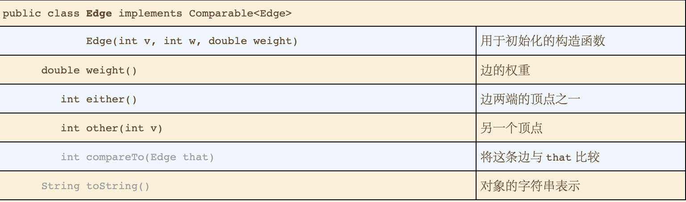

# 4.3 最小生成树
### 最小生成树的简介
* 定义
  * 图的生成树是它的一棵含有所有顶点的无环连通图。一幅加权图的最小生成树（MST）是它的一棵权值（书中所有边的权值之和）最小的生成树。
* 应用
  * 
* 约定 （仅在本书中做了如下4个约定）
  * 只考虑连通图，即最小生成树只存在于连通图中，如果图不连通，则只能生成最小连通森林。
  * 边的权重不一定表示距离，也可以表示时间，费用等。
  * 边的权重可能是0或者负数。
  * 所有边的权重都各不相同，如果存在权重相同的边，则可能生成多个最小生成图。
* 原理
  * 树的性质
    * 用一条边连接书中的任意两个顶点都会产生一个环。
    * 在树中删除一条边将会得到两棵独立的树。
  * 切分定理
    * **切分定理：** 图的一种切分是将图的所有顶点两个非空且不重叠的两个集合。横切边是一条连接两个属于不同集合的顶点的边。
      * **横切边：** 一个途中的顶点集与该顶点集的（补集）之间的连接的边称之为横切边。
    * **命题J（切分定理）：** 在一幅加权图中，给定任意切分，它的横切边中权重最小的边必然属于图的最小生成树。
  * 贪心算法
    * **命题K 最小生成树的贪心算法：** 下面这种方法会将含有V个顶点的任意加权连通图中属于最小生成的边标记为黑色：初始状态下所有边均为灰色，找到一种切分，它产生的横切边均不会黑色。将它权重最小的横切边标记为黑色。反复，直到标记了V-1条黑色边为止。
### 加权无向图的数据类型
* 将边单独定义为类
* 加权边的API
  * 
* 加权无向图的API
  * 
### 最小生成树的API
* 
### Prim算法
* 每一步都会为一棵生长中的树添加一条边，一直添加到V-1条边，每次总是将下一条连接树中的顶点与不再书中的顶点且权重最小的边加入书中。
* **命题L：** Prim算法能够得到任意加权连通图的最小生成树。

* 延时实现
  * 数据结构
    * 顶点，使用一个顶点索引的布尔数组marked[]，如果v在树中，那么marked[v]的值为true
    * 边，选择以下两种数据结构之一，一条队列mst来保存最小生成树的边，或者由一个顶点索引的Edge数组edgeTo[]， edgeTo[v]为连接到书中的Edge对象。
    * 横切边， 使用一条优先队列，MinPQ<Edge>来根据权重比比较所有的边。
  * Prim延时实现的轨迹
    * 
  * 实现
    * **命题M：** Prim算法的延时实现计算一幅含有V个顶点和E条边的连通加权无向图的最小生成树所需的空间与E成正比，所需的时间与ElogE成正比（最坏情况）
* 即时实现 
  * 要改进LazyPrimMST，可以尝试从优先队列中删除失效的边，这样优先队列就只含有树顶点和非树顶点之间的横切边，但其实还可以删除更多的边。关键在于，我们感兴趣的只是连接树顶点和非树顶点中权重最小的边。当我们将顶点v添加到树中时，对于每个非树顶点w产生的变化只可能使得w到最小生成树的距离更近了，如图4.3.11所示。简而言之，我们不需要在优先队列中保存所有从w到树顶点的边——而只需要保存其中权重最小的那条，在将v添加到树中后检查是否需要更新这条权重最小的边（因为vw的权重可能更小）。我们只需遍历v的邻接链表就可以完成这个任务。换句话说，我们只会在优先队列中保存每个非树顶点w的一条边：将它与树中的顶点连接起来的权重最小的那条边。将w和树的顶点连接起来的其他权重较大的边迟早都会失效，所以没必要在优先队列中保存它们。（从书中抄写）
  * 使用顶点索引的edgeTo[]和distTo[]数组。具有如下性质
    * 如果顶点v不再树中但至少含有一条边和树相连，那么edgeTo[v]是将v和树链接的最短边，distTo[v]为这条边的权重。
    * 所有这类顶点v都保存在一条索引优先队列中，索引v关联的只是edgeTo[v]的边的权重。
  * Prim即时实现轨迹
    * 
  * 这些性质的关键在于优先队列中最小键是权重最小的横切边的权重，而和它相关联的顶点v就是下一个被添加到树中的顶点。
  * **命题N：** Prim算法的即时实现计算一幅含有V个顶点和E条边的连通加权无向图的最小生成书的所需的空间和V成正比，所需的时间和ElogV成正比
### Kruskal算法。
* **命题O：** Kruskal算法能够计算任意加权连通图的最小生成树。
* 生成最小树的时候也是一条一条的构造，但不同的是它寻找的边会连接一片森林中的两棵树。从一片v棵淡定点的树构成的身临开始并不断的将两棵树合并，直到只剩下一棵树。
* Kruskal算法轨迹
  * 
* **命题N（续）：** Kruskal算法的计算一幅含有V个顶点和E条边的连通加权无向图的最小生成书的所需的空间和E成正比，所需的时间和ElogE成正比