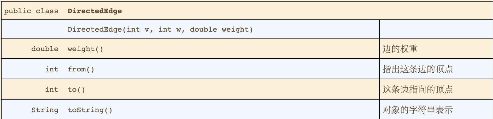

# 4.4 最短路径
* 找到从一个点到另一个点成本最小的路径。
* 应用
  * 
* 定义 
  * 在一幅加权有向图中，从顶点s到顶点t的最短路径是所有s到t的路径中权重最小者。
  * 单点最短路径
## 最短路径的性质
* 前提
  * 路径是有向的
  * 权重不一定等价于距离
  * 并不是所有顶点都是可达的
  * 副权重会使问题更复杂。
  * 最短路径不一定是唯一的
  * 可能存在平行边和环
* 最短路径树
  * 定义
    * 给定一幅加权有向图和一个顶点S，以s为起点的一棵最短路径树是图的一幅子图，它包含s和从s可达的所有顶点。这颗有向树的根结点为s，书的每条路径都是有向图中的一条最短路径。

## 加权有向图的数据机构
* 加权有向边的API
  * 
* 加权有向图的API
  * 
* 最短路径API
  * 
* 最短路径的数据结构
  * 最短路径树中的边
    * 由顶点索引的DirectedEdge对象树附链接数组，edgeTo
  * 到达起点的距离
    * 顶点索引的数组，distTo
  * 约定起点的edgeTo为null，起点的distTo为0，起点到不可达顶点的距离为Double.POSITIVE_INFINITY
* 边的松弛
  * 定义放松边v-》意味着从s到w的最短路径是否是先从s到v，然后再由v到w。如果是，则根据这个情况更新数据结构的内容。将w到的距离更新为distTo[v]+ v到w的权重，edgeTo[w]更新为v到w的边。

## 最短路径算法的理论基础
* 最优性条件
  * **命题P（最短路径的最优性条件）** 另G为一幅加权有向图，顶点s是G中的起点，distTo[]是一个由顶点索引的数组，保存的是G中路径的长度。对于从s可达的所有顶点v，distTo[v]的值是从s到v的某条路径的长度，对于从s不可达的所有顶点v，该值为无情大。当且仅当对于从v到w的任意一条边e，这些值都满足distTo[w]<=distTo[v]+e.weight()时，（换句话说，不存在有效边时）,它们是最短路径的长度。
* 通用算法
  * **命题Q（通用最短路径算法）：**将distTo[s]初始化为0，其他distTo[]元素初始化为无穷大。放松G中的任意边，直到不存在有效边为止。对于任意从s可达的顶点w，在进行这些操作之后，distTo[w]的值极为从s到w的最短路径的长度。
## Dijkstra算法 
* **命题R：** Dijkstra算法能够解决边权重非负的加权有向图的但起点最短路径问题。
* 数据结构
  * distTo，edgeTo， 还需要一个索引优先队列将索引和键（优先级）关联起来。
  * **命题R（续）：** 在一幅含有V个顶点和E条边的加权有向图中，是由Dijkstra算法计算根结点为给定起点的最短路径树所需的空间与V成正比，时间与VlogV成正比。
* 变种
  * 给定亮点的最短路径
  * 任意顶点对之间的最短路径
    * 所需的时间与EVlogV成正比，空间与V^2成正比。

## 无环加权向途中的最短路径算法
* 特点
  * 能够在线性时间内解决单点最短路径问题
  * 能够处理负权重的边
  * 能够解决相关的问题，例如找出最长的路径
* 实现
  * 按照拓扑排序的顺序放松所有顶点，就能得到起点开始的最短路径。
  * **命题S：** 按照拓扑排序顺序放松顶点，就能在和E+V成正比的时间内解决无环加权有向图的单点最短路径。
* 最长路径
  * **命题T：** 解决无环加权有向图中的最长路径问题所需的时间与E+V成正比。
  * 在一般的加权有向图（边的权重可能为负）中寻找最长简单路径的已知最好算法在最坏情况下所需的时间是指数级别的
* 并行任务调度
  * 关键路径
    * **定义：** 解决并行任务调度问题的关键路径方法的步骤如下：创建一幅无环加权有向图，其中包含一个起点s和一个终点t且每个任务都对应着两个顶点（一个起始顶点和一个结束顶点）。对于每个任务都有一条从它的起始顶点指向结束顶点的边，边的权重为任务所需的时间。对于每条优先级限制v→w，添加一条从v的结束顶点指向w的起始顶点的权重为零的边。我们还需要为每个任务添加一条从起点指向该任务的起始顶点的权重为零的边以及一条从该任务的结束顶点到终点的权重为零的边。这样，每个任务预计的开始时间即为从起点到它的起始顶点的最长距离。
  * 在无环有向图中关键路径问题可以转换为最长路径的问题。
  * **命题U：** 解决优先级限制下的并行任务调度问题的关键路径法所需的时间为线性级别。
* 相对最后期限限制下的并行任务调度
  * **命题V：** 相对最后期限限制下的并行任务调度问题是一个加权有向图中的最短路径问题。

## 一般加权有向图中的最短路径问题
* 负权重的环
  * 如果图中含有一个负权重的环，那么最短路径的概念将失去意义。
  * **定义：** 加权有向图中的负权重环是一个总权重为负的环。
  * **命题W：** 当且仅当加权有向图中至少存在一条从s到v的有向路径且s到v的有向路径上的任意顶点都不存在与任何负权重环时，s到v的最短路径才是存在的。
  * 一个定义明确且可以解决加权有向图最短路径问题的算法要能够：
    * 对于从起点不可达的顶点，最短路径为正无穷（+∞）；对于从起点可达但
    * 路径上的某个顶点属于一个负权重环的顶点，最短路径为负无穷（∞）；
    * 对于其他所有顶点，计算最短路径的权重（以及最短路径树）。
  * 负权重环的检测
    * **命题X（BellMan Ford算法）：** 在任意含有V个顶点的加权有向图中给定起点s，从s无法到达任何负权重环，以下算法能够解决其中的单点路径问题：将distTo[]初始化为0，其他distTo[]初始化为无穷大，以任意顺序放松有向图的所有边，重复V轮。
    * **命题X（续）： ** BellMan Ford算法所需时间和EV成正比，空间和V成正比。
  * 一般实现。
    * 循环v次放松所有的边。
* 基于队列的BellMan Ford算法
  * 实现
    * 使用队列来保存正在放松的顶点和下一个将要放松的顶点。直到队列为空。
      * 如果存在负权重边，则队列中会一直有值陷入死循环，需要使用负权重边环检测的方法停止循环。
    * 一个由顶点索引的boolean数组on[]，用来指示顶点是否已经存在与队列中，以防止将顶点重复插入队列。
    * 队列中不出现重复的顶点
    * 在某一轮中，改变了edgeTo和distTo的值的所有顶点都会在下一轮中处理。
  * **命题Y：** 对于任意含有v个顶点的加权有向图和给定的起点s，在最坏情况下基于队列的BellMan Ford算法解决最短路径问题所需时间与EV成正比，空间和V成正比。
* 负权重环的检测
  * 实现
    * 在完成i轮（小于V的某个值）后，如果存在负权重环，在edgeTo中必然存在一个环，此时用edgeTo构建一个图，利用有向图中环的检测方法来判断是否存在环。
* 套汇
  * **命题Z：** 套汇问题等价于加权有向图中的负权重环的检测问题。

* 最短路径算法性能特点
  * 

