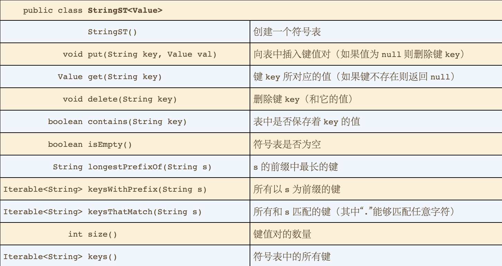
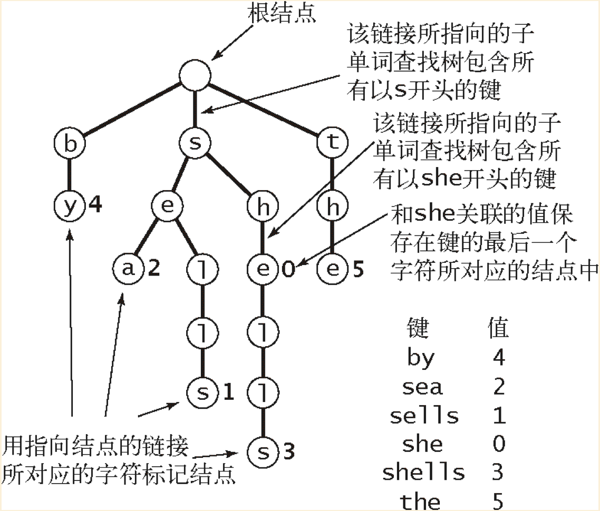
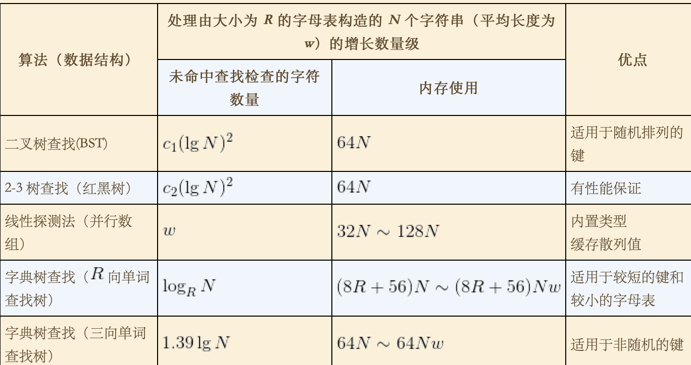

# 单词查找树
* 能够取得的性能
  * 查找命中所需的时间与被查找的键的长度成正比。
  * 查找为命中只需要检查若干字符。
* API
  * 以字符串为键的符号表API
    * 
  * 不接受重复键或空键，值不能为空。
  
## 单词查找树
* 基本性质
  * 结点
    * 每个结点右R条链接(字符表的R)，其中有的可能为空，有的连向其他结点。
    * 每个结点含有相应的值，可以是空(表明没有该单词的键)，可以有值(表明树中存在该字符串的键)。
  * 链接
    * 每条链接都对应着一个字符，因为每条链接指向一个结点，所以可以用链接所对应的字符标记被指向的结点。
  * 图示
    * 
* 单词查找树中的查找操作
  * ①　每个结点包含了下一个可能结点的链接，在root结点中找查找字符串中第一个字符对应的链接，依此类推，第二个字符在，第一个子节点中找对应的链接。
  * 如①中描述的方式去查找，则回出现如下三种情况。
    * 查找字符串的最后一个字符对应的结点的值"非空"，这是一次命中查找，键所对应的值就是键的尾字符所对应的结点中保存的值。
    * 查找字符串的最后一个字符对应的结点的值"为空"，这是一次未命中查找，符号表中不存在被查找的键。
    * 查找结束于一条"空链接"(到大查找字符串的最后一个字符之前就找不到对应的结点)，这也是一次为命中查找。
* 单词查找树中的插入操作
  * 在插入之前需要进行一次查找，在单词查找树中意味这沿着被查找的键的所有字符到达树中表示的尾字符的结点或者一个空链接。
  * 可能出现以下两种情况
    * 在到达尾字符之前就遇到了空链接。单词查找树中不存在与键的尾字符对应的结点，因此需要为键中还未被检查的每个字符创建一个对应的结点并将键的值保存到最后一个字符的结点中。
    * 在遇到空链接之前到达了键的尾字符，这种情况下，将该结点的值设为键所对应的值。
* 结点的表示
  * 将空链接考虑进来后单词查找树的重要性质
    * 每个结点都含有R个链接，对应着每个可能出现的字符。
    * 字符和键均隐式的保存在数据结构中。(这段话的意思为，结点不保存当前字符，字符保存在了父结点中指向该字符结点的数组当中，该数组又是通过字符的值作为索引的。)
  
*  API的实现
  * 大小  size方法
    * 利用一个变量存储保存键的数量。
  * 查找所有键 collect 
    * 实现的思路为从根结点开始递归调用每个链接，当某个结点中保存了值时，将到该结点路径上的字符串保存到返回用的队列当中。
  * 查抄前缀始于给定字符串的所有键 keysWithPrefix
    * 实现思路为，从给定字符串的结点开始(使用get方法获取到给定字符串最后字符对应的结点)，通过"查找所有键"的方法获取。
  * 通配符匹配(.匹配任意字符) keysThatMatch
    * 实现思路为，将匹配字符串从第一个字符开始从根结点开始寻找，如果匹配字符串中有通配符，则递归的调用所有字符。
  * 最长前缀 longestPrefixOf
    * 去寻找给定字符串在查找路径树上找到的最长键的长度（），并截取给定字符串后返回截取后的值。
  * 删除 
    * 1 找到要删除键的最后一个结点之后，将该结点的值设为null
    * 2 该结点的不存在子节点且该结点的值不存在时删去该结点。否则保留。
  * 字母表
    * 在字符表的构造函数的参数中可设定字母表的方式可修改R的大小。

## 单词查找树的性质

* **命题F：** 单词查找树的链表结构（形状）和键的插入或删除顺序无关：对于任意给定的一组键，其单词查找树都是唯一的。
  * 即无论插入的顺序如何，树的形状。其他的树构造不仅和键的集合有关，而且还和键的插入顺序相关。
* 最坏情况下的查找和插入操作的时间界限
  * **命题G：** 在单词查找树中查找一个键或是插入一个键时，访问数组的次数最多为键的长度加1。
    * 命题G表明，查找树中查找处理与树中的键的数量无关。

* 查找为命中的预期时间界限
  * **命题H：** 字母表的大小R，在一棵有N个随机键构造的单词查找树中，未命中查找平均所需检查的结点数量为logR为底的N次。
  * 该命题也说明了，查找为名中的成本于键的长度无关。
* 空间
  * **命题I：** 一棵单词查找树中的链接总数在RN到RNw之间，其中w为键的平均长度。
  * R对于空间大影响很大。

* 由于单词查找树占用过多的空间，因此尽量不实用大型字母表的大量长键。

## 三向单词查找树
* 三向单词查找树中每个结点都含有一个字符，3条链接，和一个值，这3条链接分别对应这当前字母小于，等于和大于结点的所有键。

* 实现
  * 查找与插入
    * 首先比较首字母与跟几点字母，如果较小选择左链接，较大选择右链接，相同选择中链接。递归的使用相同算法，如果遇到空链接或查找键结束时结点值为空，则"查找未命中"。如果值非空则命中。
  * 前缀匹配，查找所有键，通配符匹配
    * 以上三种方法与单词超找树的实现相匹配。
  * 删除操作
    * 只需链接数组中和该字符对应的元素置为空即可删去它的链接，需要用二叉查找树的删除结点的方法。
  

* 三向单词查找树的性质
  * 三向查找树的形状与键的插入顺序相关。
  * 空间
    * **命题J：** 由N个平均长度为w的字符串构造的三向单词构造树中的链接总数在3N到3Nw之间。
  * 查找成本
    * **命题K：** 在一棵由N个随机字符串构造的三向单词查找树中，查找未命中平均需要比较字符～lnN次。除～lnN之外，一次插入或命中的查找会比较一次被查找的键中的每个字符。
    * 最坏情况下，一个结点可能变成一个完全的R向结点，不平衡且相一条链表一样展开。

* 混合三向单词查找树。
  * 简单的方法就是维护一张含有R棵三向单词查找树的表。
  * 这种方法有效的前提是首字母的分布必须均匀。

* 单向分支
  * **命题L：** 由个随机字符串构造的根结点进行了向分支且不含有外部单向分支的三向单词查找树中，一次插入或查找操作平均需要进行约次字符比较。

## 应该使用字符串符号表的那种实现
* 如果空间足够，向单词查找树的速度是最快的，能够在常数次字符比较内完成查找。对于大型字母表，向单词查找树所需的空间可能无法满足时，三向单词查找树是最佳的选择，因为它对“字符”比较次数是对数级别的比较，而二叉查找树中键的比较次数是对数级别的。散列表也是很有竞争力的，但如前文所述，它不支持有序性的符号表操作，也不支持扩展的字符类API操作，例如前缀或通配符匹配。
* 

