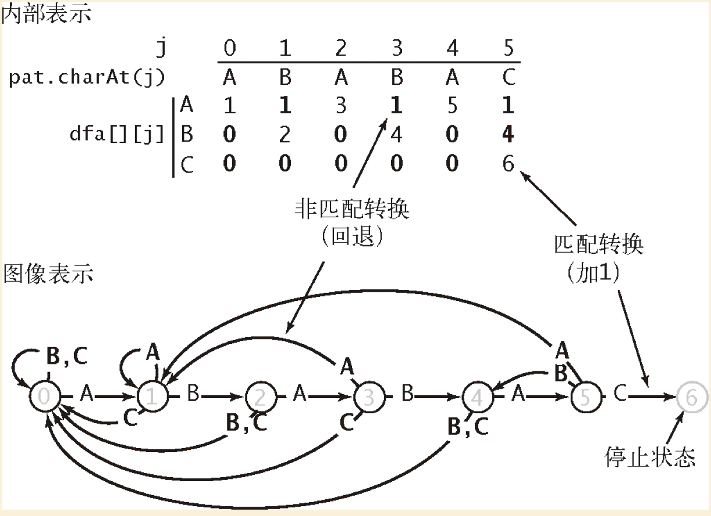
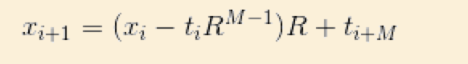

# 5.3 子字符串查询

## 暴力子字符串查找算法
* 命名
  * M 模式的长度
  * N 文本的长度
  * i 文本的跟踪指针
  * j 模式的跟踪指针
* 实现
  * 指针i跟踪文本，指针j跟踪模式，对于每一个i，首先将j重置为0，并将不断增大。
  * 表文本中索引为i+j的字符与模式中索引为j的字符，如果相同，则j+1 不同则退出循环比较，i+1
  * 文本的循环，直到N-M+1处结束则表明未找到，如果j==M 则表明找到了匹配的子字符串。
* **命题M：** 在最坏情况下，暴力字符串查找算法在长度为N的文本中查找长度为M的模式需要～ N*M次字符比较。

## Knuth-Morris-Pratt子字符串查找算法（KMP算法）
* [KMP参考资料](https://mp.weixin.qq.com/s/2xzHt42Bd8uoWhhnaQfduw)

* 模式指针的回退
  * KMP子字符串查找算法中，不会回退文本指针i，而是一个数组DFA[][]来记录失败时模式指针j应该回退多远。
  * DFA（有限确定状态自动机）
    * 该状态机是由状态（数字标记的圆圈）和转换（带标签的箭头）组成的。
    * 模式中每个字符都对应着一个状态，
    * DFA[文本字符][模式字符的索引] 的形式构成，如果文本字符和模式字符相同时，DFA数组中的值为j+1（表示因为两边字符相匹配，返回当前模式字符索引的下一个索引用来匹配），如果文本字符与模式字符不相同时，则返回将模式字符向左移动的索引（具体返回什么值在构造DFA中说明）。
    * 图示
      * 

* 构造DFA
  * 原理（不一定对直觉上是这样）
    * 如果遇到的字符在它的前缀中出现过，则移动到前前缀的某处，如果不在前缀当中，则移动到模式的第一个字符处
    * 从影子状态（X）复制信息到j（模式字符串的索引，从1到M-1） 就是将j之前的信息学习过来。
    * X的状态需要随着j的变化要更新，更新的逻辑为X遇到的j即为跳转到下一个字符索引的逻辑（即j为更新前的X是相同的字符）
  * 实现
    * 初始化X
    * 将DFA[][X]复制到DFA[][j]（对于失败的情况）？
    * 将DFA[与j索引模式字符相同的字符(pat.charAt(j))][j]] 设为 j+1（对于匹配成功）
    * 更新X
  * 构造过程
    * 图示
      * 
* API
  * 
  * 搜索的实现
    * 文本索引j从左想用移动一个字符，模式字符j根据DFA[][]确定下一步移动的位子。
    * 当j==M 或 i == N时结束循环
    * 如果j == M则表明找到，返回模式字符在文本中的起始索引。

  * **命题N：** 对于长度为M的模式字符串和长度为N的文本，Knuth-Morris-Pratt字符串查找算法访问的字符不会超过M+N个。
  * 构造DFA所需的总时间（和空间）将与MR成正比。

## Boyer-Moore字符串查找算法
* 这段子字符串查找算法的实现的构造函数根据模式字符串构造了一张每个字符在模式中出现的最右位置的表格。查找算法会从右向左扫描模式字符串，并在匹配失败时通过跳跃将文本中的字符和它在模式字符串中出现的最右位置对齐。

* 命名
  * i 文本字符指针，从左向右。
  * j 模式字符指针，从右向左。
* 从右向左匹配字符，如果发上不匹配时文本和模式中的字符来决定下一步的行动
* 起点
  * 在该步骤生成right[]数组，记录字母表中每个字符在模式中出现的最靠右的地方。
  * right数组中初始值为-1 ，该数组的值表明如果匹配失败，应该向右跳跃多远。
* 子字符串查找
  * 匹配字符串，如果匹配成功j向左移动。
  * 如果匹配失败，则会是三种情况。
    * 如果文本字符在模式字符串中不存在，则将模式字符串向右移动j+1个位置。即将模式字符串移动到，文本中匹配字符串的下一个字符处。
    * 如果文本字符在模式字符串中存在，那就使用right[]来将模式字符串和文本对齐。向右移动 j - right[字符索引]
    * 如果第二种情况中，无法向右移动（j< right[字符索引]) ，则向右移动一个位置 i+1。
    * 图示
      * 
  * 这里的BM算法没右与计算不匹配的情况，并为最坏情况提供线性级别的运行（类似KMP表）。
  * **命题O：** 在一般情况下，对于长度为N的文本和长度为M的模式字符串，使用了Boyer-Moore的子字符串查找算法通过启发式处理不匹配的字符需要～N/M次字符比较。
* 实现 描述不是很精确
  * 1 构造字符表大小的right数组， 并将模式字符在模式字符串中出现的最右的位置写入。
  * 2 查询 。  
    * i指针从左向右移动文本字符，j字符串从右向左移动。
    * 文本指针移动的外循环一直执行到N-M+1处，。
    * 模式指针移动的内循环匹配字符，如果匹配将从右向左移动，如果不匹配，使用right或j+1的方式移动i指针。
  

## Rabin-Karp指纹字符串查找算法

* 基本思想
  * 长度为M的字符串对应着一个R进制的M为数，用Q（在不益出的前提下尽可能的大）除余得到一个int散列值。
  * 在文本中获得前M长度字符串的散列值后，与模式的散列值进行比对，如果值相同则找到，文本移动到N-M后停止。
  * 计算散列值的关键思想
    * Xi表明i索引开始的M个字符值。
      * 
    * Xi+1的计算方式
      * 
    * Xi+1的计算方式简单来说去掉最高位的值后向左移1位，并加上新的值到最右边的最低位。
    * 除余操作的基本性质是如果在每次算术操作之后都将结果除以Q并取余，等价余完成了所有算术操作之后再将最后的结果除以Q并取余。
  * **蒙特卡洛算法**，为了保证出现哈希冲突概率极小，Q可以选择大于10^20素数，保证冲突的概率小于1/10^20。
  * **拉斯维加斯算法**，在发现值相同的字符串后与模式字符串比较所有字符，来判断正确性。
  
* 实现
  * 首先计算模式的散列值并保存，同时将R^M-1 取余Q的值保存，用于计算Xi+1的值。
  * 计算文本中第一个字符开始的M个字符的散列值，并于模式的散列值进行比较。
    * 如果值相同，找到了子字符串。
    * 不相同则在循环中向右移动一个字符，重新执行散列值计算与比较的操作。

* 命题P 使用蒙特卡洛算法的Rabin-Karp子字符串查找算法的运行时间是线性级别的且出错的概率极小，使用拉斯维加斯算法的Rabin-Karp子字符串查找算法能够保证正确性，且行呢能极其接近线性级别。

## 总结
* 2总结了我们已经讨论过的各种子字符串查找算法。尽管常常出现多个算法都能完成相同的任务的情况，但它们都各有特点：暴力查找算法的实现非常简单且在一般的情况下都工作良好；（Java的String类型的indexOf
* 图示
  * 