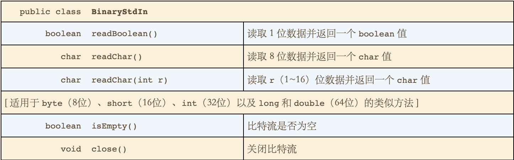
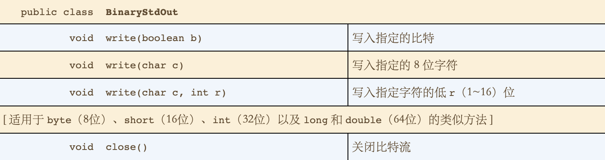
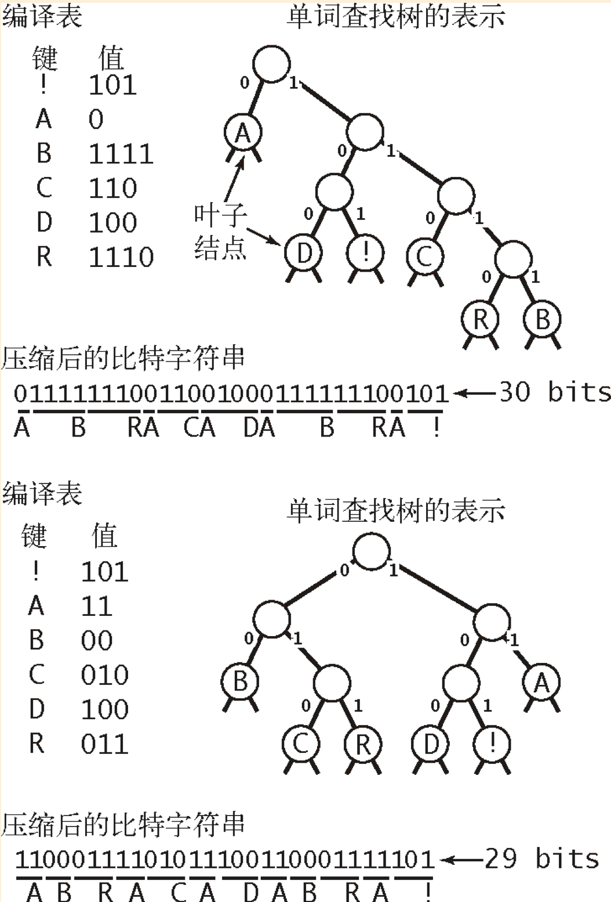
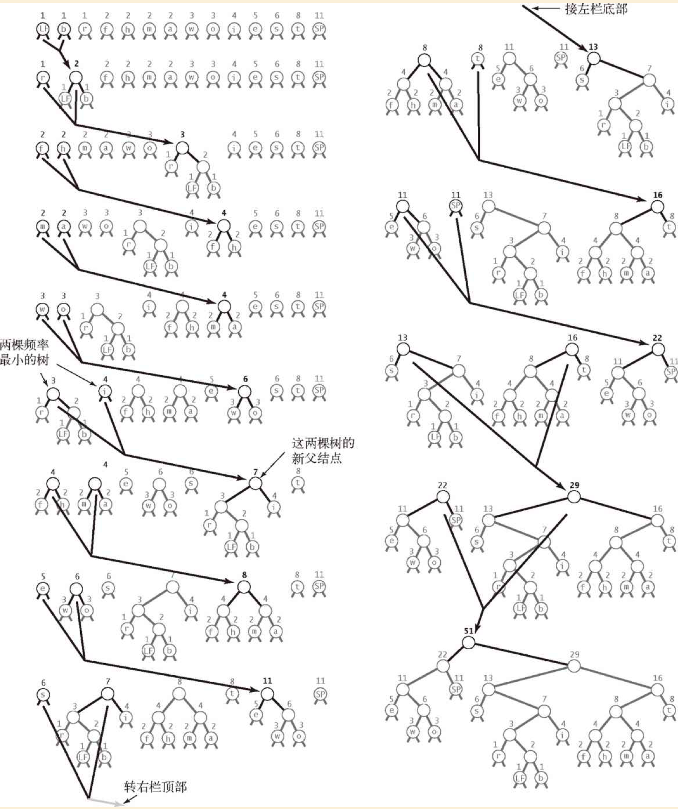
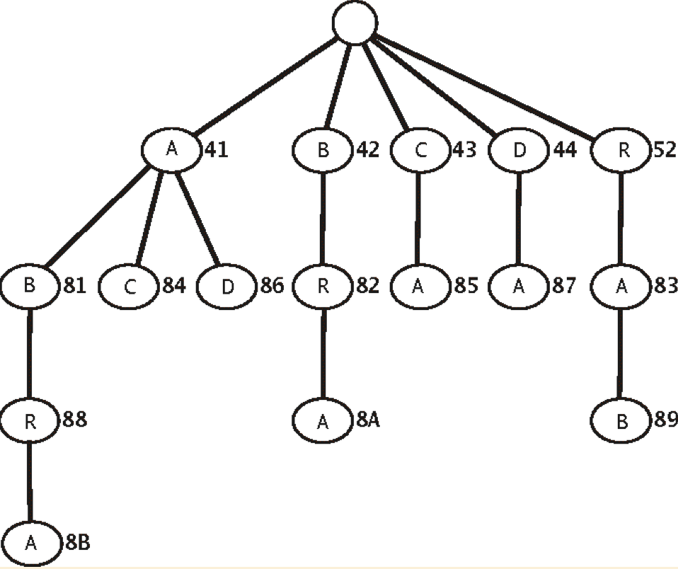

# 数据压缩

* 读写二进制数据
  * 从标准输入读取比特流的静态方法API
    * 
  * 从标准输出中写入比特流的静态方法的API
    *  
  * 二进制转储
    * BinaryDump 
    * HexDump
    * PictureDump
  
* 局限
  * **命题S：** 不存在能够压缩任意比特流的算法。
  * 可以证明最优数据压缩是一个**不可判定问题**
  * 以下四种特点的数据，可以考虑使用本节的压缩算法。
    * 小规模字符表
    * 较长的连续相同位或字符
    * 频繁使用的字符
    * 较长的连续重复的位或字符

* 热身运动：基因组
  * 双位编码压缩
    * 实现
      * 将基因的四个类型ACTG用Alphabet，这样就会存在0-3对应的值。
      * 将一段基因片段一个字符一个字符的读取后，将其转换位0-3对应值。
      * 将这四个值用2位来表示。即 00 01 10 11 
  * 双位编码的解压
    * 实现
      * 与压缩步骤相反，根据2位的反回到Alphabet类中的整数型
      * 根据上述步骤的整数型转换位ACTG的字符

* 游程编码
  * 该字符串含有15个0，然后是7个1，然后是7个0，然后是11个1， 将这些个数表示为4位的二进制数
    * 15=1111，7=0111，7=0111，11=1011 的方式组织。
    * 编码后的结果为 1111，0111，0111，1011。 
    
  * 游程长度应该在0到255之间，使用8位编码；
  *  在需要的情况下使用长度为0的游程来保证所有游程的长度均小于256；
  *  我们也会将较短的游程编码，虽然这样做有可能使输出变得更长。

  * 位图
    * 用二进制表示图像 文中以q的二进制表示为例
    * 开始是以0开始，0和1出现的总数必须位奇书
  
  * 实现
    * 读取一个比特；
    * 如果它和上一个比特不同，写入当前的计数值并将计数器归零；
    * 如果它和上一个比特相同且计数器已经到达最大值，则写入计数值，再写入一个0计数值，然后将计数器归零；
    * 增加计数器的值。
 

* 霍夫曼压缩
  * 核心思想，通过用较少的比特表示出现频繁的字符而用较多的比特表示偶尔出现的字符来节省空间，这样字符串所使用的总比特数就会降低。
  * 变长前缀码
    * 所有字符编码都不会成为其他字符编码的前缀，那么不需要分隔符。
  * 前缀码和单词查找树
    * 任意含有个空链接的单词查找树都为个字符定义了一种前缀码方法：我们将空链接替换为指向叶子结点（含有两个空链接的结点）的链接，每个叶子结点都含有一个需要编码的字符。这样，每个字符的编码就是从根结点到该结点的路径表示的比特字符串，其中左链接表示0，右链接表示1
    * 单词查找树图示
      *  
  * 数据压缩的5个步骤
    * 压缩
      * 构造一棵单词查找树
      * 将该树以字节流的形式写入输出以供展开时使用
      * 使用该树将字节流编码为比特流
    * 展开
      * 读取单词查找树（保存在比特流的开头）
      * 使用该树将比特流解码

  * 单词查找树的结点
    * 与一般树的结点类似，左子节点， 右子节点，频率，字符组成。

  * 使用前缀码展开
    * 有了单词查找树就可以将比特流还原，例如0111110比特流，第一个0 从根结点查找对应的字符，0时向左，1时向右，当遇到叶子结点（左右子节点均为空时）则找到，此时0 对应的字符为A，之后返回到根结点。
    * 111 比特流，向右 三次，遇到的叶子结点为B 展开后得到ABR。。。

  * 使用前缀码压缩
    * 使用前缀码压缩前，首先需要根据单词构造树生成编译表， 用字符做索引，编码值作为键。 构建编译表是使用前序遍历的方式。
    * 有了编译表之后，将需要压缩的字符串一个一个读取后，将其转换为比特流后转换。

  * 单词查找树的构造
    * 第一步，创建一片许多只有一个结点的树所组成的森林。
    * 第二步，自底向上根据频率低的顺序一棵树。
      * 从有点队列中取得将两颗频率低的一个结点构成的树结合，生成一个新的树，新树的根结点为只包含频率。（两个单个结点树的频率之和）
      * 生成了新的树将其放入到优先队列当中。
      * 重复上述过程直到优先对为空为止。
    *  
    
  * 最优性
    * **命题T：** 对于任意前缀码，编码后的比特字符串的长度等于相应单词查找树的 **加权外部路径长度** 。
      * 加权外部路径长度： 所有叶子结点的权重（频率）和深度之积的和。
    * **命题U：** 给定一个含有r个字符的集合和他们的频率，霍夫曼算法所构造的前缀码是最优的。

  * 写入和读取单词查找树
    * 写入
      * 使用前序遍历的方式对数树进行读取，如果是内部结点则输出为0，如果是叶子结点是输出1并加上叶子结点字符的8位ASC编码。
    * 读取
      * 读取比特信息，如果是1 那么就读取字符编码，并创建叶子结点，如果是0，那么就创建内部结点并（递归的）创建左右子树。

  * 霍夫曼压缩的实现
    * 压缩
      * 读取输入
      * 将输入中的每个字符的出现次数制成表格。
      * 根据频率构造相应的霍夫曼编码树。
      * 构造编译表，将输入中的每个char值和一个比特字符串相关联。
      * 将单词查找树编码为比特字符串并写入输出流。
      * 将单词总数编码为比特字符串并写入输出流。
      * 使用编译表翻译每个输入字符。
    * 展开
      * 读取单词查找树（编码在比特流开头）
      * 读取需要解码的字符数量
      * 使用单词查找树将比特流解码。

* LZW压缩算法
  * LZW单词查找树
    * 两种符号表操作
      * 找到输入和符号表的所有键的最长匹配前缀。
      * 将匹配的键和前瞻字符相连得到一个新建，将新建和下一个编码关联并添加到符号表中。
    * 单词查找树的图示
      * 
  * LZW压缩的展开
    * 展开时会维护一张关联字符串和编码值的表。
    * 在这张表中加入00到7F和所有ASC字符的字符串的关联条目。
    * 将第一个未关联的编码设为81，将保存了当前字符串的变量val设为含有第一个字符的字符串，遇到80 就结束。
      * 输出当前字符串val
      * 从输入中读取一个编码x
      * 在符号表中将s设为和x相关联的值
      * 在符号表中将下一个未分配的编码值设为val+c，其中c为s的首字母
      * 将当前字符串val设为s

  * 压缩
    * LZW压缩算法的基础是维护一张字符串键和（定长）编码的编译表
      * 在符号表中128个单字符的键初始化为8位编码。
      * 找出未处理的输入在符号表中最长的前缀字符串s。
      * 输出s的8位值（编码）
      * 继续扫描s之后的一个字符c
      * 在符号表中将s+c的值设为下一个编码值。
  