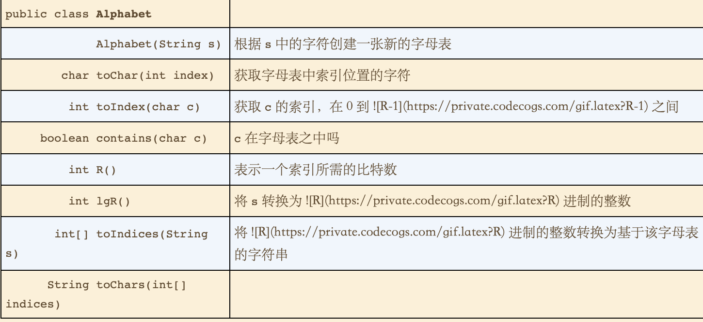
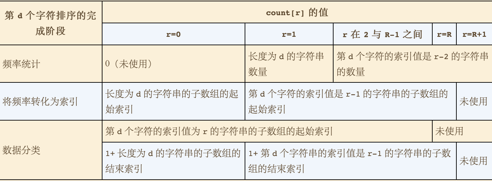
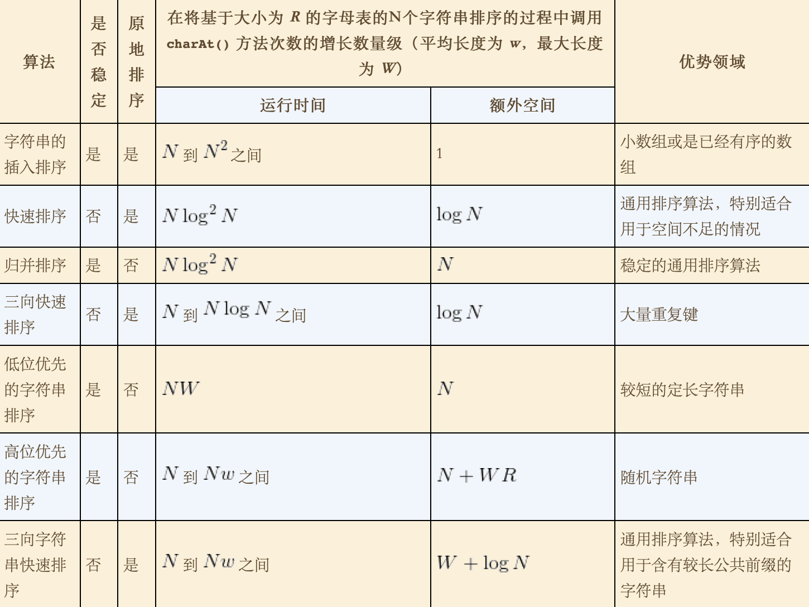

# 5 字符串
* 字母表
  * API
  * 
# 5.1 字符串排序
* 两种排序方法
  * 1 LSD 低位优先字符串排序(从左至右)
    * 适用于长度相同的字符串排序。
  * 2 MSD 高位优先字符串排序(从右至左)
    * 在长度不相同时也可进行排序。

* 键索引计数法
  * 适用于小整数键的简单排序法。
  * 步骤
    * 统计频率
      * 实现
        * 创建统计频率的键数组时，数组大小加1
    * 将频率转换为索引
    * 数据分类
      * 在第二步生成了索引的基础上，每对键插入到相应的位置之后，自增该组的索引值，以保证下一个该组的值能够插入到对应的位置。
    * 回写
* **命题A:** 键索引排序法排序N个键为0到R-1之间的整数的元素需要访问数组11N+4R+1次
* 只要R在N的一个常数因子范围内，键索引排序都是一个线性级别的排序方法。

## 低位优先的字符串排序
* 实现
  * 如果字符长度均为W，那就从右向左以每个字符作为键，用键索引计数法将字符串排序W边。
* **命题B:** 低位优先的字符串排序算法能够稳定地将定长字符串排序。
* **命题B(续):** 对于基于R个字符的字母表的Nge以长为W的字符串为键的元素，低位优先的字符串排序需要访问~7WN+3WR次数组，使用的额外空间与N+R成正比。

## 高位优先的字符串排序
* 能够解决字符串不定长的排序。
* 首先用键索引计数法将所有字符串按照首字母排序，然后(递归的)再将每个首字母所对应的子数组排序。
  * 对字符串末尾的约定
    * 字符串末尾的值因不在字母表中，因此末尾的值设定为-1。 在用于统计的变量中不存在-1的索引，在实现中对其+1处理，0表示末尾，1表示第一个字母。
  * 在实现中，当子数组大小小于M(一般为15)时转换为插入排序，根快速排序很想。
  * 高位优先的字符串排序中count[]数组的意义
    * 
  * 小型子数组
    * 对于小数组切换到插入排序对于高位优先的字符串排序算法是必须的。
  * 等键值
    * 高位优先字符串排序中，对于含有大量等值键的子数组的排序会较慢。
    * 最坏情况就是键均相同。
  * 额外空间
  * 随机字符串模型
  * 性能
    * 对于随机输入，高位优先的字符串排序算法只会检查足以区别字符串所需的字符。相对于输入数据中的字符总数，算法的运行时间是亚线性的（它只会检查输入字符中的一小部分）。
    * 对于非随机的输入，高位优先的字符串排序算法可能仍然是亚线性的，但需要检查的字符可能比随机情况下更多。特别是对于相等的键，它需要检查它们的所有字符，所以当存在大量等值键时它所需的运行时间是接近线性的。
    * 在最坏情况下，高位优先的字符串排序算法会检查所有键中的所有字符，所以相对于数据中的所有字符它所需的运行时间是线性的（和低位优先的字符串排序算法相同）。最坏情况下的输入中所有的字符串均相同。
    
    * **命题C:** 要将基于大小为R的字母表的N个字符串排序，高位优先的字符串排序算法平均需要检查N * log(R为底) (N的对数)个字符
    * **命题D:** 要将基于大小为R的字母表的N个字符串排序，高位优先的字符串排序算法访问数组的次数在8N+3R到7wN+3wR，其中w为字符串的平均长度。
    * **命题D(续):** 要将基于大小为R的字母表的N个字符串排序，高位优先的字符串排序算法所需的空间与R乘以最长字符串的长度之积成正比(再加上N)。

## 三向字符串快速排序
* 实现
  * 根据键的首字母进行三向切分，尽在中间子数组中的下一个字符继续递归排序。
* 随机化
  * 打乱元素组，能够防止数组已经有序或接近有序的最坏情况
* 性能
  * **命题E:** 要将含有N个随机字符串的数组排序，三向字符串快速排序平均需要比较字符~2Nln(N)次
* 各种字符串排序的性能特点
  * 