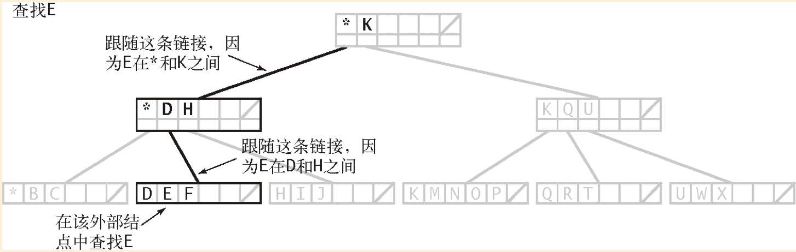
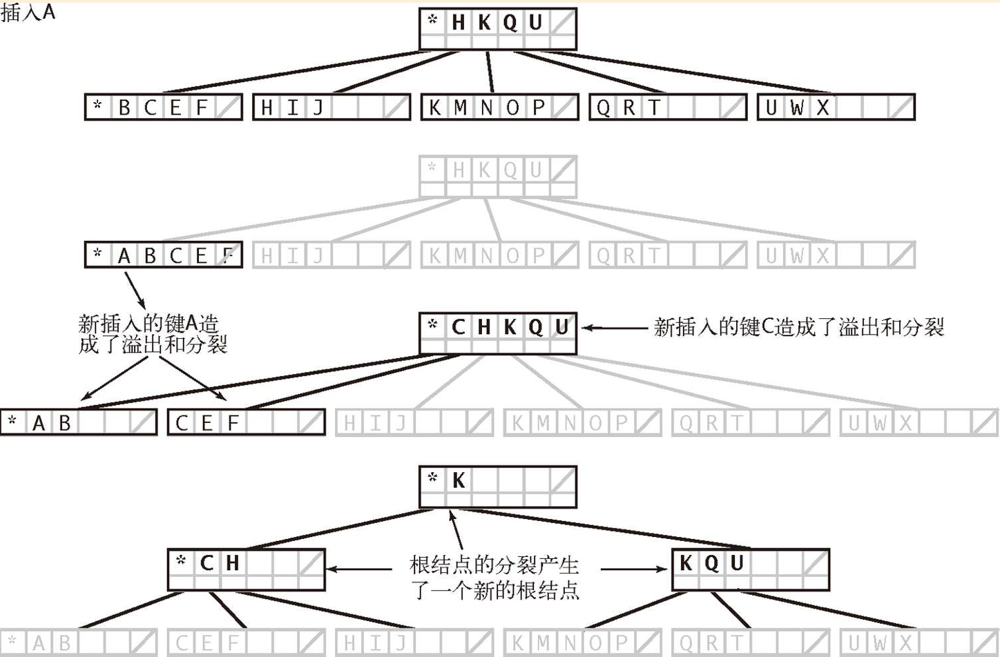
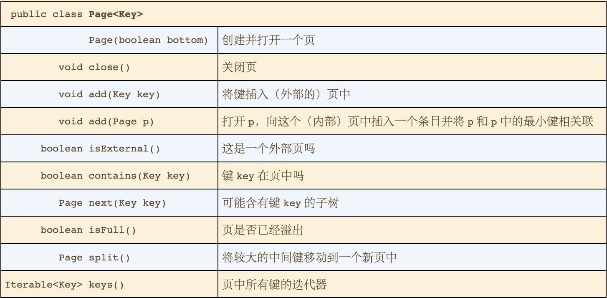

# B-树
* 成本模型
  * 用语
    * 页 表示一块连续的数据（页可能是本地计算机的文件，也可能是远程计算机的网页）
    * 探查 表示访问的页
  * 使用页的访问次数（无论读写）作为外部查找算法的成本模型
  
* M阶B树
  * 选择参数M（一般是偶数）并构造一棵多向树，每个结点最多含有M-1对键和链接，最少含有M/2对键和链接。
  * 根结点是例外它可以含有少于M/2对键和链接，但不能少于2对键和链接

* 约定
  * 内部结点：含有与页相关联的键的副本
  * 外部结点：含有指向实际数据的引用
  * 内部结点中每个键都与一个结点相关联，以此结点为根的子树中所有的键都大于等于此结点关联的键，但小于原内部结点中的更大的键。
    * 为了方便这里使用一个特殊的烧饼键，它小于其他所有的键。
    
* 查找和插入
  * B树中查找的基础是在可能含有被查找键的唯一子树中进行递归搜索。当且仅当被查找的键班汉在集合中时，每次查找便会结束与一个外部结点。在内部结点中遇到被查找的键和副本时就判断查找命中并结束。
  
  * 定义
    * 一棵M阶B-树或者仅是一个外部K-结点（含有K个键和相关信息得树），或者由若干内部K-结点（每个结点都含有k个键和k条链接，链接指向的子树表示了键之间的间隔区域）组成。它的结构性质如下：
      * 从根结点到外部结点的路径长度均相同（完美平衡）；对于根结点，k在2到M-1之间，对于其他结点k在M/2到M-1之间。
    * 图示
      * B树查找
        * 
      * B树插入
        * 
 
* 数据表示
  * Page对象来表示结点
  * API
    * 

* 性能
  * 命题B： 含由N个元素的M阶B-树中的一次查找或插入操作需要lomM （N）～ logM/2 （N）此探查-在实际情况下这基本是一个常数。
  
  * 空间需求
    * 