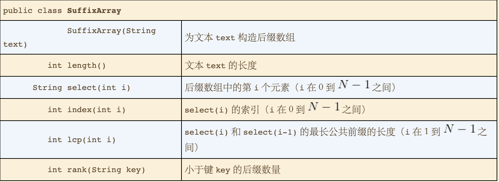

# 后缀排序
* 最长重复子字符串
    * 暴力解法
      * 将1-N长度的子字符串在字符串中查找。
      * 所需的时间至少是字符串长度的平方级别
      
* 后缀排序
  * 实现
    * 搜集字符串的所有后缀子字符串到数组中，并对数组排序。
    * 最长重复子字符串在数组的相邻位置中。

* 定位字符串
  * 通过反向索引表，可以建立关键字与字符串（网页等）的联系，不过会有搜索结果不一致的情况（thing 和 everything）

* API及其应用
  * 后缀数组的API
    * 

  * 使用后缀排序的应用
    * LRS 找出文本中最长子字符串
    * KWIC  找出关键的上下文信息。

  * 实现
    * 搜集文本的后缀子字符串到子字符串数组当中。
    * 对子字符串数组进行排序。
    * 各个API都会利用排完序之后的数组。

* 性能
  * 在java中每个子字符串是由标准对象，指向原字符串的指针组成，因此索引的大小和字符串的长度是线性关系。
  * **命题c：** 使用三向字符串快速排序，构造长度为N的随机字符串的后缀数组，平均所需的空间与N成正比，字符比较次数与～2NlnN成正比。
  * **命题D：** 使用后缀数组，我们可以在线性时间内解决后缀排序和最长重复子字符串问题。
  
  * 优化
    * 在有很多重复的字符的情况下，初级实现的后缀排序的性能会降到平方级。需要考虑出现重复字符的情况下的处理。
  